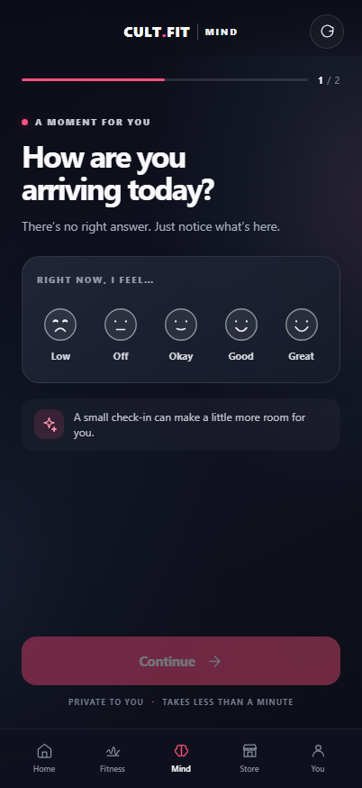
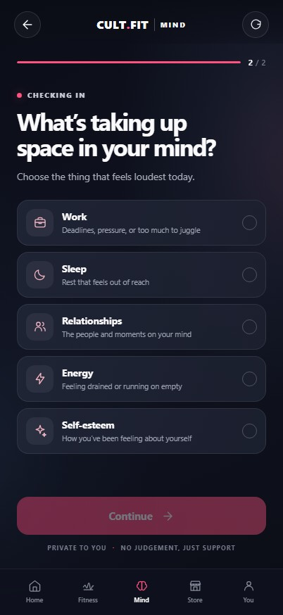
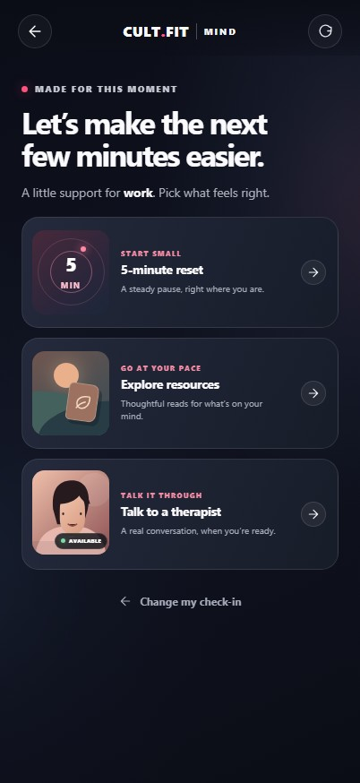
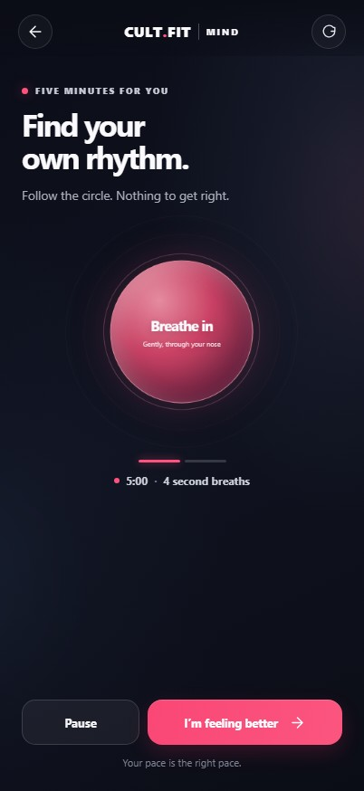
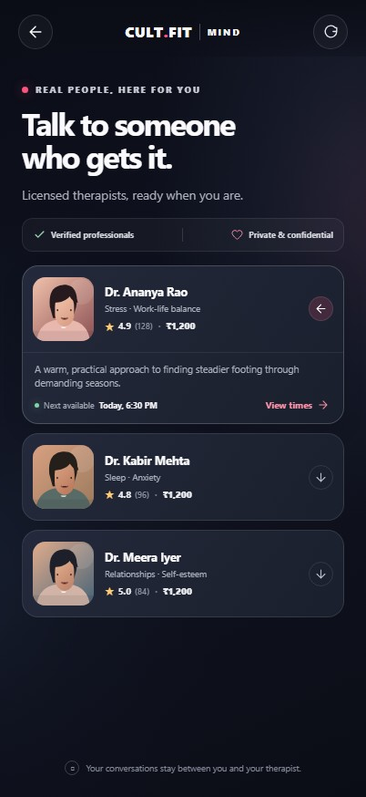
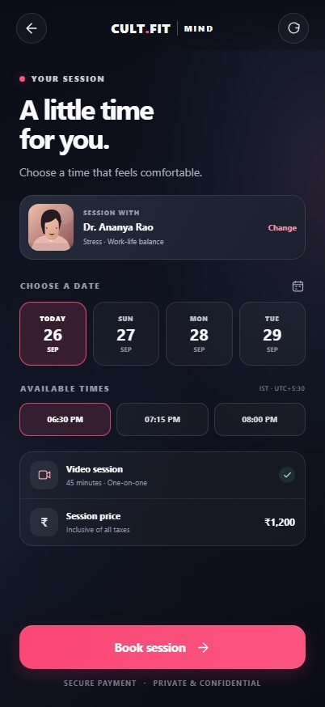
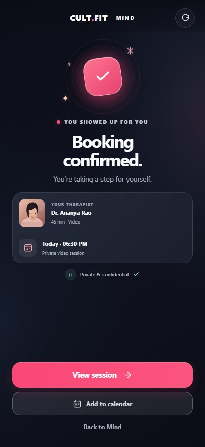

# CULT.FIT Mind

A mobile-first, interactive mental-wellness prototype for the CULT.FIT app. The flow moves from a mood check-in to personalized support, a five-minute breathing reset, therapist discovery, session booking, and confirmation.

## Screenshots

Captured at **402 × 874**. Therapist profiles, availability, and booking details are mock data; booking is a local prototype interaction.

<table>
  <tr>
    <td align="center"><br /><sub>Mood check-in</sub></td>
    <td align="center"><br /><sub>What’s on your mind</sub></td>
  </tr>
  <tr>
    <td align="center"><br /><sub>Personalized support</sub></td>
    <td align="center"><br /><sub>Five-minute reset</sub></td>
  </tr>
  <tr>
    <td align="center"><br /><sub>Therapist discovery</sub></td>
    <td align="center"><br /><sub>Choose a session</sub></td>
  </tr>
  <tr>
    <td align="center"><br /><sub>Booking confirmed</sub></td>
    <td></td>
  </tr>
</table>

## Run locally

Requires Node.js and pnpm.

```sh
pnpm install
pnpm dev
```

Open the local URL printed by Vite. The prototype is tuned for a **402 × 874** mobile viewport and adapts to smaller screens.

## About

- React + Vite, with minimal dependencies
- No authentication, backend, or database
- Mock therapist data and local-only interactions
- Responsive dark UI with CULT.FIT pink accents
